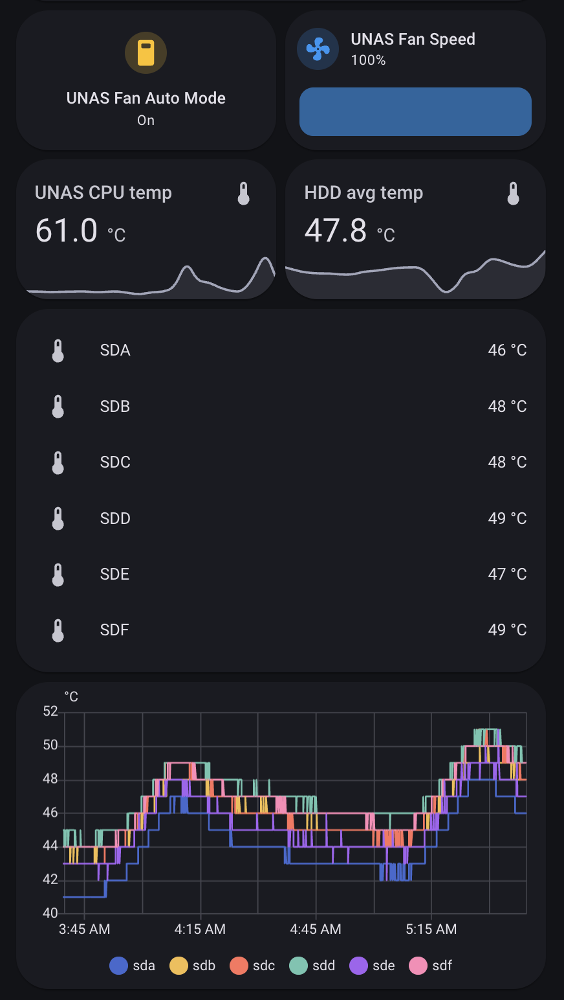

# UNAS Pro Monitoring & Fan Control

Fork of the original UNAS Pro fan control project, extended with Home Assistant integration via MQTT and system monitoring.

## Overview

This project provides two **independent** systemd services for the UniFi UNAS Pro:

1. **UNAS Monitor** (`/unas_monitor`) - Publishes system metrics to Home Assistant via MQTT
2. **Fan Control** (`/fan_control`) - Temperature-based fan speed control with Home Assistant override capability

**Important:** These services are completely independent. You can use either one without the other:

- **Just want monitoring in HA?** → Deploy only `unas_monitor`
- **Want custom fan control without HA?** → Deploy only `fan_control` (remove MQTT code)
- **Want both monitoring AND control in HA?** → Deploy both services

Both services survive reboots and can be quickly redeployed after UNAS firmware updates.

### HA Dashboard Example


## Which Services Do I Need?

### Option 1: System Monitoring Only
**You want:** Drive temps, CPU temp, storage usage, and fan speeds visible in Home Assistant via MQTT
**Deploy:** `unas_monitor` service only  
**You get:**
- All drive temperatures as HA sensors
- CPU temperature as HA sensor
- Current fan speed (PWM and %) as HA sensors
- Storage pool usage, size, used, and available space
- No changes to fan behavior (UNAS controls fans normally)

### Option 2: Custom Fan Control Only
**You want:** Better fan curve than stock UNAS firmware  
**Deploy:** `fan_control` service only (optionally remove MQTT code)  
**You get:**
- Custom linear fan curve based on drive temps only
- No Home Assistant integration needed

### Option 3: Full Integration
**You want:** Everything - monitoring AND control from HA  
**Deploy:** Both `unas_monitor` and `fan_control` services  
**You get:**
- All temperature and storage sensors in HA
- Custom fan curves with HA override capability
- Manual fan speed control from HA dashboard
- Critical temperature failsafe automation
- Full visibility and control

## Features

**UNAS Monitor:**
- Real-time temperature monitoring (drives and CPU)
- Storage pool usage tracking
- Current fan speed reporting
- MQTT integration with Home Assistant auto-discovery
- 10-second update interval
- Extensible for additional metrics (SMART health, drive hours, etc.)

**Fan Control:**
- Configurable linear fan curve
- Manual fan speed override from Home Assistant
- Critical temperature failsafe (auto-switches to 100% fans)
- 1-second response time

**Both Services:**
- Survive reboots via systemd
- Auto-install dependencies
- Quick redeployment after firmware updates

## Quick Start

### Prerequisites

- UNAS Pro with SSH access
- (Optional) Home Assistant instance with MQTT broker add-on (Mosquitto) and MQTT integration set up
- (Optional) MQTT user credentials

### Deployment - Monitoring Only

If you only want system metrics in Home Assistant:

1. Clone this repository
2. Update MQTT credentials in `unas_monitor/unas_monitor.sh`:
   ```bash
   MQTT_HOST="192.168.1.111"
   MQTT_USER="homeassistant"
   MQTT_PASS="your_password"
   hdd_devices=(sda sdb sdc sdd sde sdf)  # Match your drives
   ```
3. Deploy:
   ```bash
   cd unas_monitor
   ./deploy_unas_monitor.sh root@YOUR_UNAS_IP
   ```
4. Sensors will auto-appear in Home Assistant

### Deployment - Fan Control Only

If you only want custom fan curves (no HA integration):

1. Clone this repository
2. (Optional) Remove MQTT code from `fan_control/fan_control.sh` if you don't need HA integration
3. Configure fan curve in `fan_control/fan_control.sh`:
   ```bash
   MIN_TEMP=43    # Start ramping up fans
   MAX_TEMP=47    # Full speed
   MIN_FAN=204    # 80% baseline
   ```
4. Deploy:
   ```bash
   cd fan_control
   ./deploy_fan_control.sh root@YOUR_UNAS_IP
   ```

### Deployment - Full Integration

If you want both monitoring and control:

1. Clone this repository
2. Update MQTT credentials in **both** scripts:
   - `fan_control/fan_control.sh` - Update `MQTT_HOST`, `MQTT_USER`, `MQTT_PASS`
   - `unas_monitor/unas_monitor.sh` - Update `MQTT_HOST`, `MQTT_USER`, `MQTT_PASS`
3. Configure fan curve in `fan_control/fan_control.sh` (see above)
4. Deploy both services:
   ```bash
   cd fan_control
   ./deploy_fan_control.sh root@YOUR_UNAS_IP
   
   cd ../unas_monitor
   ./deploy_unas_monitor.sh root@YOUR_UNAS_IP
   ```
5. Configure Home Assistant (see service READMEs)

## How It Works

**UNAS Monitor (unas_monitor):**
- Reads drive temps via SMART every 10 seconds
- Reads CPU temp from thermal zone
- Reads current fan PWM value
- Reads storage pool usage from df
- Publishes all to MQTT → HA auto-discovers sensors
- **Does not change fan behavior**

**Fan Control (fan_control):**
- Reads drive temps via SMART every 1 second
- Calculates fan speed using linear curve
- Checks MQTT for override commands from HA
- Applies fan speed via PWM control
- Publishes current fan speed to MQTT (if HA integration enabled)
- **Overrides UNAS firmware fan control**

**Home Assistant Integration (when both deployed):**
- User toggles auto/override mode or adjusts fan speed slider
- HA publishes MQTT message with desired fan speed (or "auto")
- Fan control service reads override and applies it
- UNAS monitor shows real-time results
- Failsafe automation forces auto mode if temps too high

## Components

### UNAS Monitor Service
See [unas_monitor/README.md](unas_monitor/README.md) for details on:
- Configuring monitored metrics
- MQTT sensor setup
- Home Assistant configuration
- Adding new metrics (SMART health, drive hours, etc.)
- Viewing logs

### Fan Control Service
See [fan_control/README.md](fan_control/README.md) for details on:
- Fan curve configuration
- MQTT override system
- Deployment and testing
- Choosing between simple and advanced scripts

## Post-Update Redeployment

UNAS firmware updates wipe custom scripts but preserve systemd service files. After an update, redeploy the services you're using:

**Monitoring only:**
```bash
./unas_monitor/deploy_unas_monitor.sh root@YOUR_UNAS_IP
```

**Fan control only:**
```bash
./fan_control/deploy_fan_control.sh root@YOUR_UNAS_IP
```

**Both:**
```bash
./fan_control/deploy_fan_control.sh root@YOUR_UNAS_IP
./unas_monitor/deploy_unas_monitor.sh root@YOUR_UNAS_IP
```

Services will auto-restart and resume normal operation.

## Requirements

- UNAS Pro running UniFi OS 4.2.6+
- Root SSH access via SSH key
- (Optional) Home Assistant with MQTT integration
- (Optional) Mosquitto MQTT broker

## License

MIT License - see LICENSE.md

## Credits

Forked from [hoxxep/UNAS-Pro-fan-control](https://github.com/hoxxep/UNAS-Pro-fan-control)
