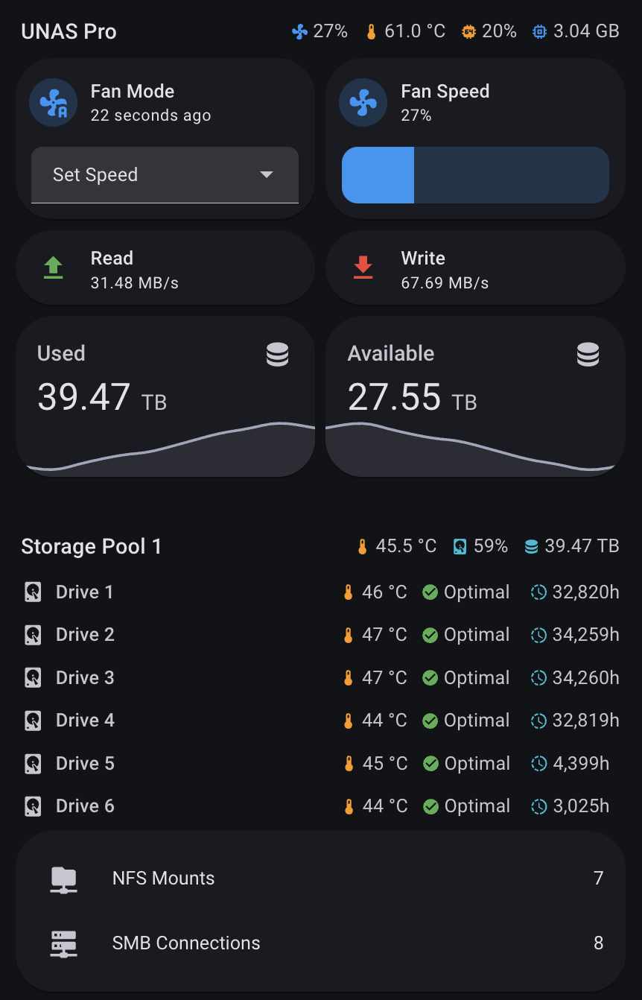

# UniFi UNAS for Home Assistant

[](https://github.com/hacs/integration)
[](https://github.com/cardouken/homeassistant-unifi-unas/releases)
[](https://github.com/cardouken/homeassistant-unifi-unas/blob/main/LICENSE.md)
[](https://github.com/cardouken/homeassistant-unifi-unas/stargazers)

Monitoring and fan control for UniFi UNAS with native Home Assistant integration.

## Table of Contents

- [Features](#features)
- [Known Limitations](#known-limitations)
- [Supported Devices](#supported-devices)
- [What's Included](#whats-included)
- [Installation](#installation)
- [Setup](#setup)
- [Fan Control Modes](#fan-control-modes)
- [Troubleshooting](#troubleshooting)
- [Advanced](#advanced)
- [Credits](#credits)

## Features

- **One-Click Setup** - Automatic script deployment via SSH
- **Full Monitoring** - 40+ sensors for drives, system metrics, storage pools, and network shares
- **Fan Control** - Three modes with custom temperature curves
- **Auto-Recovery** - Scripts redeploy automatically on integration updates or if missing after firmware updates
- **Native Integration** - Proper HA devices and entities with MQTT discovery

## Known Limitations

- **Device Model** - Cannot be changed after initial setup. Changing requires removing and re-adding the integration.
- **Storage Pool Names** - Pool names cannot be retrieved via SSH. Pools are numbered based on their underlying volume
  UUID (sorted alphabetically), which in some cases may not match the names shown in UniFi Drive. If pool names are
  incorrect, simply rename the entities in Home Assistant.

## Supported Devices

- **UNAS Pro** – Fully supported
- **UNAS Pro 8** – Fully supported
- **UNAS Pro 4** – Unconfirmed, bays possibly not mapped correctly
- **UNAS 4** – Unconfirmed
- **UNAS 2** – Unconfirmed

<details>
<summary><strong>Help confirm device support!</strong></summary>

If you own a UNAS Pro 4, UNAS 4, or UNAS 2, you can help confirm drive bay mappings by running this command
on your UNAS via SSH:

```bash
for dev in /dev/sd?; do
    ata_port=$(udevadm info -q path -n "$dev" | grep -oP 'ata\K[0-9]+')
    serial=$(smartctl -i "$dev" 2>/dev/null | grep 'Serial Number' | awk '{print $NF}')
    model=$(smartctl -i "$dev" 2>/dev/null | grep 'Device Model' | awk '{$1=$2=""; print $0}' | xargs)
    echo "Device: $dev | ATA Port: $ata_port | Serial: $serial | Model: $model"
done
```

**Example output:**

```
Device: /dev/sda | ATA Port: 1 | Serial: ZR5FFXXX | Model: ST18000NM001J-2TV113
Device: /dev/sdb | ATA Port: 4 | Serial: ZR51DXXX | Model: ST18000NM000J-2TV103
Device: /dev/sdc | ATA Port: 5 | Serial: ZR5FHXXX | Model: ST18000NM001J-2TV113
```

Then check the UniFi Drive UI and match the serial numbers to physical bay numbers. For example:

- `/dev/sda` - ATA Port 1 - Bay 6
- `/dev/sdb` - ATA Port 4 - Bay 3
- `/dev/sdc` - ATA Port 5 - Bay 5

Please [open a GitHub issue](https://github.com/cardouken/homeassistant-unifi-unas/issues) with your results to help
improve device support!

</details>

## What's Included

### Sensors

- **System** - CPU temperature & usage, memory usage, disk I/O throughput, fan speed (PWM & percentage), uptime, OS
  version
- **Drives (HDD)** - Temperature, SMART health status, model, serial, firmware, RPM, power-on hours, bad sectors
- **Drives (NVMe)** - Temperature, SMART health, percentage used (wear), available spare, media errors, unsafe shutdowns
- **Storage** - Pool usage, size, available space
- **Network** - SMB connection count (with client details as attributes), NFS mount count (with share details as
  attributes)

### Binary Sensors

- **Scripts Installed** - Whether monitoring scripts are deployed on UNAS
- **Monitor Service** - Whether the monitoring service is running
- **Fan Control Service** - Whether the fan control service is running

### Controls

- **Fan Mode** (Select) - UNAS Managed / Custom Curve / Set Speed
- **Fan Speed** (Number) - Manual speed control, 0-100% (only in "Set Speed" mode)
- **Fan Curve Parameters** (Numbers) - Min/max temperature (20-60°C), min/max fan speed (0-100%)

### Buttons

- **Reinstall Scripts** - Manually redeploy scripts to UNAS
- **Reboot** - Reboot the UNAS device
- **Shutdown** - Shutdown the UNAS device



## Installation

### Prerequisites

1. **MQTT Integration** (Required) - Must be installed **before** adding UniFi UNAS
    - Settings → Devices & Services → Add Integration → MQTT
    - If using Mosquitto add-on: Select automatic discovery
    - If using external broker: Enter broker details manually

2. **Mosquitto MQTT Broker** (Recommended)
    - Settings → Add-ons → Add-on Store → Mosquitto broker
    - Install, start, and enable "Start on boot"
    - Configure login credentials under Mosquitto broker add-on → Configuration → Options → Logins
    - **Note**: You can use any MQTT broker, but Mosquitto add-on is easiest

3. **SSH Access to UNAS**
    - Enable SSH access in UniFi Drive via Settings → Control Plane → Console → check "SSH" and configure password

### Install Integration

**Via HACS (Recommended):**

[](https://my.home-assistant.io/redirect/hacs_repository/?owner=cardouken&repository=homeassistant-unifi-unas&category=integration)

Or manually: HACS → Integrations → Search "UniFi UNAS" → Download → Restart HA

**Manual:**

1. Download latest release
2. Extract to `custom_components/unifi_unas/`
3. Restart HA

## Setup

### Add Integration

[](https://my.home-assistant.io/redirect/config_flow_start/?domain=unifi_unas)

Or manually: Settings → Devices & Services → Add Integration → Search "UniFi UNAS"

Enter details:

- **Host**: UNAS IP (e.g., `192.168.1.25`)
- **Username**: `root`
- **Password**: Your UNAS SSH password
- **MQTT Host**: Home Assistant IP (e.g., `192.168.1.111`)
- **MQTT User**: Your Mosquitto username configured earlier in the add-on
- **MQTT Password**: Your Mosquitto password configured earlier in the add-on
- **Device Model**: Select your UNAS model from the dropdown
- **Polling Interval**: How often to poll for metrics (5-60 seconds)

The integration will automatically:

- Deploy scripts to UNAS via SSH
- Configure systemd services
- Set up MQTT auto-discovery
- Create all devices and entities

## Fan Control Modes

### 1. UNAS Managed

Lets UNAS control the fans automatically (default behavior). Use this if you only want monitoring without fan control.

### 2. Custom Curve

Linear temperature-based fan curve. The fan speed scales linearly between min and max based on temperature:

```
Fan Speed
    ▲
max ┤........╱
    │     ╱
    │   ╱
min ┤─╱
    └─────────────► Temperature
      min    max
```

**Configure via:** Settings → Devices & Services → UniFi UNAS → Device → Adjust the four curve parameters

**Example presets:**

| Preset     | Min Temp | Max Temp | Min Fan | Max Fan |
|------------|----------|----------|---------|---------|
| Quiet      | 40°C     | 50°C     | 15%     | 30%     |
| Balanced   | 38°C     | 48°C     | 30%     | 70%     |
| Aggressive | 35°C     | 45°C     | 70%     | 100%    |

### 3. Set Speed

Lock fans to a fixed speed (0-100%). Use the Fan Speed slider to set the desired speed.

## Troubleshooting

### Scripts Not Installing

Check logs: Settings → System → Logs → search "unifi_unas"

Common issues:

- **Cannot connect** → Verify UNAS IP and root password
- **Timeout** → Check SSH access (port 22)
- **Permission denied** → Must use `root` account

### Sensors Not Appearing

1. Verify MQTT integration is installed (Settings → Devices & Services → MQTT)
2. Verify Mosquitto broker is running
3. Check MQTT credentials are correct in integration config
4. Check service status on UNAS:
   ```bash
   ssh root@YOUR_UNAS_IP
   systemctl status unas_monitor fan_control
   ```

### Drives Not Appearing

New or moved drives may take up to 60 seconds to appear (grace period for detection).

### Wrong Bay Numbers

Your device model may have incorrect bay mappings. See [Supported Devices](#supported-devices) section to help confirm
mappings.

### MQTT Integration Removed

If you remove the MQTT integration after setup, a repair issue will appear. Reinstall MQTT and reload the integration.

### After Firmware Update

Scripts redeploy automatically on startup if missing. If needed, manually reinstall via the "Reinstall Scripts" button
on the device page.

### Removing Integration

Removing the integration fully restores your UNAS to stock. The cleanup process:

1. **Stops and disables services** - `unas_monitor` and `fan_control` systemd services
2. **Removes all scripts** - `/root/unas_monitor.py`, `/root/fan_control.sh`
3. **Removes service files** - From `/etc/systemd/system/`
4. **Removes temp files** - State files from `/tmp/`
5. **Uninstalls packages** - `mosquitto-clients`, `paho-mqtt`, `python3-pip`
6. **Restores fan control** - Returns PWM control to UNAS-managed mode

No manual cleanup is required.

## Advanced

<details>
<summary><strong>MQTT Topics</strong></summary>

Topics use the prefix `unas/{entry_id}/` where `entry_id` is the first 8 characters of your config entry ID.

```
unas/{id}/
├── availability          # "online" or "offline"
├── system/               # CPU, memory, disk I/O, fan, uptime
├── hdd/{bay}/            # Per-drive SMART data
├── nvme/{slot}/          # NVMe drive data
├── pool/{num}/           # Storage pool stats
├── smb/                  # SMB connections
├── nfs/                  # NFS mounts
└── control/
    ├── monitor_interval  # Polling interval
    └── fan/              # Fan mode and curve parameters
```

</details>

<details>
<summary><strong>Debug Logging</strong></summary>

Add to `configuration.yaml`:

```yaml
logger:
  default: info
  logs:
    custom_components.unifi_unas: debug
```

</details>

<details>
<summary><strong>Script Locations</strong></summary>

Scripts are deployed to `/root/` on the UNAS:

- `/root/unas_monitor.py` - Monitoring script
- `/root/fan_control.sh` - Fan control script

Systemd service files:

- `/etc/systemd/system/unas_monitor.service`
- `/etc/systemd/system/fan_control.service`

Manual service control:

```bash
systemctl status unas_monitor fan_control
systemctl restart unas_monitor
systemctl restart fan_control
```

</details>

## Credits

- **Fan control concept**: [hoxxep/UNAS-Pro-fan-control](https://github.com/hoxxep/UNAS-Pro-fan-control)

## License

MIT - See [LICENSE.md](LICENSE.md)

## Support

- [GitHub Issues](https://github.com/cardouken/homeassistant-unifi-unas/issues)
