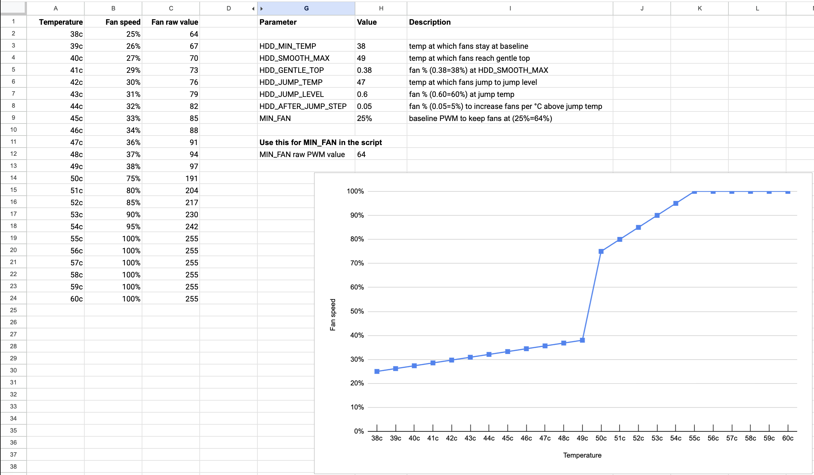

# Fan Control Service

Temperature-based fan speed control with Home Assistant override capability via MQTT.

## Available Scripts

### fan_control.sh (Recommended)

Simple linear fan curve based on HDD temperatures only. Use this if:

- You want straightforward temperature-based fan control
- You don't need CPU temperature to affect fan speeds
- You're using aftermarket fans (like Noctua) or stock fans

### fan_control_with_cpu.sh (Legacy/Advanced)

Includes both CPU and HDD temperature monitoring with piecewise curve support. Originally developed to add piecewise fan
curves to the upstream project, but less necessary now that Ubiquiti introduced their own fan control UI. Use this if:

- You need CPU temperature to influence fan speeds
- You want more complex piecewise fan curves with multiple segments
- You have specific thermal requirements that need multi-segment control

**Piecewise Curve Calculator:** Use
the [UNAS Pro Fan Speed Curve Calculator](https://docs.google.com/spreadsheets/d/1tRFY_sbZ05NGviTWXEZ2xo6C26Qct_KZbIP7jislLXI/edit?usp=sharing)
to visualize and configure complex piecewise curves for `fan_control_with_cpu.sh`.



**Note:** Both scripts support MQTT override from Home Assistant.

## How They Differ

**fan_control.sh:**

- Monitors HDD temps only
- Simple linear curve with configurable temperatures
- Lighter weight, less CPU overhead
- Fully configurable via top-level variables
- Recommended for most users

**fan_control_with_cpu.sh:**

- Monitors both HDD and CPU temps
- Supports piecewise curves with multiple segments
- Takes max of CPU fan speed and HDD fan speed
- More configuration options (jump temps, gentle tops, etc.)
- Useful if CPU runs hot and needs independent fan response

Both scripts:

- Run as systemd services
- Check temps every 1 second
- Support MQTT override from Home Assistant
- Fight UNAS firmware for fan control
- Publish current fan speed to HA

## Features

- Configurable linear fan curve
- Checks temperatures every 1 second
- MQTT override system (manual fan speed control from HA)
- Fights UNAS firmware fan control by setting PWM to manual mode
- Publishes current fan speed to Home Assistant

## Fan Curve Configuration

Edit the top of `fan_control.sh` to adjust the fan curve:

```bash
MIN_TEMP=43               # Temperature (°C) where fans start ramping up from baseline
MAX_TEMP=47               # Temperature (°C) where fans reach maximum speed
MIN_FAN=204               # Baseline PWM (204 = 80%)
MAX_FAN=255               # Maximum PWM (255 = 100%)
```

### Example Configurations

**Conservative (quieter, warmer drives):**

```bash
MIN_TEMP=40
MAX_TEMP=50
MIN_FAN=153    # 60%
MAX_FAN=255    # 100%
```

Result: 40°C: 60%, 45°C: 80%, 50°C: 100%

**Balanced (recommended for Noctua fans):**

```bash
MIN_TEMP=43
MAX_TEMP=47
MIN_FAN=204    # 80%
MAX_FAN=255    # 100%
```

Result: 43°C: 80%, 45°C: 90%, 47°C: 100%

**Aggressive (cooler, louder):**

```bash
MIN_TEMP=38
MAX_TEMP=45
MIN_FAN=178    # 70%
MAX_FAN=255    # 100%
```

Result: 38°C: 70%, 41.5°C: 85%, 45°C: 100%

### PWM to Percentage Conversion

To convert percentage to PWM: `PWM = (Percentage / 100) * 255`

Examples:

- 60% = 153 PWM
- 70% = 178 PWM
- 80% = 204 PWM
- 90% = 230 PWM
- 100% = 255 PWM

## MQTT Configuration

Edit MQTT credentials in the script:

```bash
MQTT_HOST="192.168.1.111" # Your HA IP
MQTT_USER="homeassistant"
MQTT_PASS="your_password"
```

Also update your drive list:

```bash
hdd_devices=(sda sdb sdc sdd sde sdf)  # Adjust to match your drives
```

## Deployment

**Important:** Update `deploy_fan_control.sh` to deploy the script you want to use.

By default it deploys `fan_control.sh`. To use `fan_control_with_cpu.sh` instead, edit the deployment script:

```bash
# Change this line:
scp fan_control.sh "${HOST}:/root/fan_control.sh"

# To this:
scp fan_control_with_cpu.sh "${HOST}:/root/fan_control.sh"
```

Then deploy:

```bash
./deploy_fan_control.sh root@YOUR_UNAS_IP
```

This will:

1. Copy your chosen fan control script to `/root/fan_control.sh`
2. Copy `fan_control.service` to `/etc/systemd/system/`
3. Enable and start the service

## Manual Testing

Run once without service mode to see calculated fan speeds:

```bash
ssh root@YOUR_UNAS_IP
/root/fan_control.sh
```

Example output:

```
/dev/sda HDD Temp: 43°C
/dev/sdb HDD Temp: 45°C
/dev/sdc HDD Temp: 44°C
== Fan Decision ==
Max HDD Temp: 45°C → Fan PWM: 230 (90%)
==================
Confirmed fan speeds:
230
230
```

## MQTT Topics

**Subscribes to:**

- `homeassistant/unas/fan_override` - Receives "auto" or PWM value (0-255)

**Publishes to:**

- `homeassistant/sensor/unas_fan_speed/state` - Current fan PWM value
- `homeassistant/sensor/unas_fan_speed/config` - Auto-discovery config

## Home Assistant Setup

See main README for full HA configuration. Key entities:

- `switch.unas_fan_auto_mode` - Toggle auto/override
- `number.unas_fan_speed_control` - Fan speed slider (0-100%)
- `sensor.unas_fan_speed` - Current PWM value
- `sensor.unas_fan_speed_percentage` - Current percentage

Add to `configuration.yaml`:

```yaml
mqtt:
  switch:
    - name: "UNAS Fan Auto Mode"
      state_topic: "homeassistant/unas/fan_override"
      command_topic: "homeassistant/unas/fan_override"
      payload_on: "auto"
      payload_off: "255"
      state_on: "auto"
      retain: true

template:
  - number:
      - name: "UNAS Fan Speed Control"
        unique_id: unas_fan_speed_control
        min: 0
        max: 100
        step: 1
        unit_of_measurement: "%"
        state: >
          {{ ((states('sensor.unas_fan_speed') | int(0)) * 100 / 255) | round(0) }}
        set_value:
          - condition: state
            entity_id: switch.unas_fan_auto_mode
            state: 'off'
          - service: mqtt.publish
            data:
              topic: "homeassistant/unas/fan_speed_percent"
              payload: "{{ value | int }}"
              retain: true

  - sensor:
      - name: "UNAS Fan Speed Percentage"
        unit_of_measurement: "%"
        state: >
          {{ ((states('sensor.unas_fan_speed') | int(0)) * 100 / 255) | round(0) }}
```

Create automation in `automations.yaml` or in the automations editor UI (editor YAML below):

```yaml
alias: UNAS Fan Speed Percentage to PWM
description: Convert percentage slider to PWM value for fan override
triggers:
  - trigger: mqtt
    topic: homeassistant/unas/fan_speed_percent
conditions: [ ]
actions:
  - data:
      topic: homeassistant/unas/fan_override
      payload: "{{ (trigger.payload | int * 255 / 100) | round(0) }}"
      retain: true
    action: mqtt.publish
mode: single
```

## Critical Temperature Failsafe (optional)

Add this automation to receive a critical alert and force auto mode if temperatures get too high:

```yaml
alias: UNAS Critical Temperature Failsafe
description: Emergency auto mode if any HDD exceeds 50°C or CPU exceeds 82°C
triggers:
  - trigger: numeric_state
    entity_id:
      - sensor.unas_sda_temperature
      - sensor.unas_sdb_temperature
      - sensor.unas_sdc_temperature
      - sensor.unas_sdd_temperature
      - sensor.unas_sde_temperature
      - sensor.unas_sdf_temperature
    above: 50
  - trigger: numeric_state
    entity_id:
      - sensor.unas_cpu_temperature
    above: 82
conditions: [ ]
actions:
  - data:
      topic: homeassistant/unas/fan_override
      payload: auto
      retain: true
    action: mqtt.publish
    alias: Set UNAS Fan mode to 'auto' via MQTT
  - data:
      title: UNAS Critical Temperature Alert
      message: >-
        
          CPU reached {{ trigger.to_state.state }}°C!
        
          Drive {{ trigger.to_state.name }} reached {{ trigger.to_state.state }}°C!
        

        Fan: {{ states('sensor.unas_fan_speed') }} PWM ({{ states('number.unas_fan_speed_control') }}%)
        Fan switched to AUTO mode.
      data:
        push:
          sound:
            name: default
            critical: 1
            volume: 0.3
    action: notify.mobile_app_YOUR_DEVICE
    alias: Send critical notification
  - delay:
      minutes: 30
    alias: Wait 30 minutes before allowing another notification
mode: single
```

Update the notification action with your device name.

## Logs

View service logs:

```bash
ssh root@YOUR_UNAS_IP "journalctl -u fan_control -f"
```

In service mode (default), only override messages are logged to reduce spam. For detailed logging, run manually:

```bash
ssh root@YOUR_UNAS_IP
/root/fan_control.sh
```

## Troubleshooting

**Fans jumping between speeds:**

- UNAS firmware fighting for control - this is normal. UNAS takes a while to figure out what PWM value to use, test
  which one is closest to the desired speed to have less jumping.
- Service sets PWM to manual mode every second to maintain control

**Override not working:**

- Check MQTT credentials in fan control script
- Verify mosquitto-clients is installed on UNAS: `apt list --installed | grep mosquitto`
- Check HA automation "UNAS Fan Speed Percentage to PWM" is enabled
- Test MQTT connection: `mosquitto_pub -h YOUR_HA_IP -u user -P pass -t test -m "hello"`

**Service not starting after reboot:**

- Check service status: `ssh root@YOUR_UNAS_IP "systemctl status fan_control"`
- View logs: `ssh root@YOUR_UNAS_IP "journalctl -u fan_control -n 50"`
- Redeploy: `./deploy_fan_control.sh root@YOUR_UNAS_IP`

**Fans not ramping up properly:**

- Verify MIN_TEMP and MAX_TEMP are appropriate for your setup
- Check drive temperatures are being read: run script manually
- Ensure hdd_devices array matches your actual drives
- Test SMART is working: `ssh root@YOUR_UNAS_IP "smartctl -a /dev/sda"`

**MQTT connection fails:**

- Verify MQTT broker is running in HA
- Check firewall allows MQTT port (default 1883)
- Test from UNAS: `mosquitto_sub -h YOUR_HA_IP -u user -P pass -t test -v`